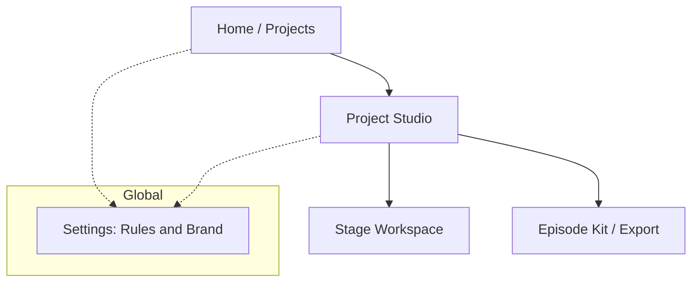
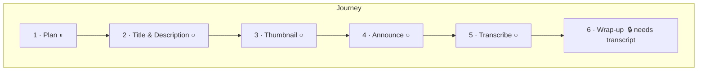
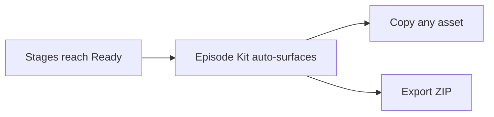

# Stream Helper — UX/UI Redesign Proposal

Status: proposal for review (no code changes yet)
Goal: make the whole workflow a joy to use, with an always-clear answer to
"where am I, what can I do, and what should I do next?"

---

## 1. Why the current UI feels strange

Concrete friction points in today's build:

1. **No sense of progress.** Six equal tabs (Pre-stream, Description, Thumbnail,
   Social, Transcription, Post-stream) with no indication of order, completion,
   or what depends on what. Everything looks equally "unstarted."
2. **Hidden core controls.** Working drafts, project notes, and "LLM definitions"
   live in side drawers behind toggles. The things you use most are hidden; the
   things you rarely need are always visible.
3. **Jargon leaks.** "LLM definitions", "effective prompt", "variant", "strategy",
   "Copy JSON", "Raw response JSON", "LLM context debug" — internal vocabulary is
   shown to the creator.
4. **Invisible dependencies.** Chapters/Summary silently require a transcript.
   Thumbnail/Description quietly reuse earlier outputs. The user only finds out by
   getting an error or by guessing.
5. **Flat result presentation.** Every generation dumps variant cards + a raw JSON
   `<details>`. There's no "here is the winner, here's how to use it" moment.
6. **No finish line.** "Mark final" and "Export ZIP" exist but nothing guides the
   user toward a satisfying "your episode kit is ready" completion.

The redesign keeps 100% of existing capability (same endpoints, same artifacts,
same storage) but reframes it as a **guided, progress-driven journey**.

---

## 2. Design principles

1. **One clear next step, always.** The UI always highlights the single most useful
   action, while keeping everything else reachable.
2. **Progressive disclosure.** Show the creator-facing essentials; tuck technical
   detail (raw JSON, composed prompt) behind a calm "Advanced" affordance.
3. **Speak the creator's language.** Replace engine jargon with plain words:
   _Options_ not _variants_, _Rules_ not _LLM definitions_, _Best pick_ not
   _recommended_.
4. **Make dependencies visible and friendly.** If a step needs a transcript, say so
   up front with a shortcut, not an error after the click.
5. **Celebrate momentum.** Completion states, checkmarks, and a final "episode kit"
   give the workflow a beginning, middle, and satisfying end.
6. **Calm, focused visuals.** Keep the existing modern aesthetic but reduce visual
   noise, increase whitespace, and use color intentionally (status, not decoration).

---

## 3. Information architecture

Three levels, each with a clear job:



- **Home (Projects):** pick or create a project. Each project card shows real
  progress ("4 of 6 stages have a final pick").
- **Project Studio:** the cockpit. A left **journey rail** (the 6 stages as a
  vertical stepper with status), a central **workspace**, and a right **context
  panel** (notes + the finished picks feeding this step).
- **Stage Workspace:** one focused task at a time with guidance, action(s),
  result, and history.
- **Episode Kit:** a summary of every "final pick" with copy/download, and the
  Export ZIP as the finish line.

---

## 4. The core idea: a guided journey rail

Replace the flat tab strip with a **vertical stepper** that doubles as navigation
and progress. Each stage shows a status chip:

- ○ **Not started** — no drafts, no outputs
- ◐ **In progress** — has drafts or generated options but no final pick
- ● **Ready** — a final pick is selected
- 🔒 **Needs a prerequisite** — e.g. Chapters/Summary before a transcript exists



The rail always has one stage marked **"Next up"** based on completion, so the
user never wonders where to go. Prerequisite locks are soft: clicking a locked
stage explains why and offers a one-click jump to the step that unlocks it
("Transcribe first →").

Stage renames (plain language):

| Current tab            | New name                | One-line intent                         |
|------------------------|-------------------------|-----------------------------------------|
| Pre-stream planning    | **1 · Plan**            | Decide the topic and guest              |
| Description            | **2 · Title & Description** | Write the YouTube title, description, tags |
| Thumbnail              | **3 · Thumbnail**       | Design the thumbnail                    |
| Social Media           | **4 · Announce**        | Create LinkedIn, X posts, hashtags      |
| Transcription          | **5 · Transcribe**      | Turn the recording into text            |
| Post-stream wrap-up    | **6 · Wrap-up**         | Generate chapters and a summary         |

---

## 5. Anatomy of a stage workspace

Every stage uses the same predictable 3-zone layout, so once you learn one, you
know them all.

```
┌─────────────────────────────────────────────────────────────┐
│  Stage title + status         [ Next up: Thumbnail → ]       │
├───────────────────────────┬─────────────────────────────────┤
│  WORKSPACE (center)        │  CONTEXT (right)                │
│                            │                                 │
│  ▸ What this step does     │  Uses these finished picks:     │
│  ▸ Your brief (autosaves)  │   • Topic: "…"        ●         │
│  ▸ [Primary action]        │   • Title: "…"        ●         │
│    [secondary] [secondary] │                                 │
│                            │  Project notes (peek)           │
│  ── Result ──────────────  │   …                             │
│  ★ Best pick  [Use] [Final]│                                 │
│  Other options (collapsed) │                                 │
│                            │                                 │
│  ⌄ History for this step   │                                 │
└───────────────────────────┴─────────────────────────────────┘
```

Key behaviors:

- **"What this step does"** — a single friendly sentence + the visible list of
  what it will reuse (pulled from the same context the composer already uses).
- **One primary button** per stage (e.g. _Generate description_), secondary
  actions de-emphasized (e.g. _Titles_, _Tags_). No wall of equal buttons.
- **Best pick first.** The recommended option is shown large with two obvious
  actions: **Copy** and **Set as final**. Other options collapse under
  "Show N more options."
- **Inline validation as helpful hints,** not raw codes: "Tags are 512/500 chars —
  trimmed to fit" instead of `YT_TAGS_TOO_LONG`.
- **Refine as a chat bubble** under each option ("Make it punchier"), unchanged in
  behavior but framed conversationally.
- **Advanced (collapsed):** raw JSON and the composed prompt move here, labeled
  "See exactly what the AI received." Nothing is removed — just demoted.

---

## 6. Stage-by-stage guidance

Each stage gets a **checklist of the possibilities** so the user always knows what
they *can* do and what to do next.

**1 · Plan**
- Do: write a brief → generate topic ideas → generate guest ideas → set a final topic.
- Next-step nudge: "Pick a final topic to unlock a stronger Title & Description."

**2 · Title & Description**
- Do: generate 15 titles → pick one; generate description; generate tags.
- Reuses: final topic/guest. Shows them in the context panel.

**3 · Thumbnail**
- Do: generate 10 ideas → turn the best into prompts → create external prompt
  package **or** built-in image.
- Guardrail: built-in image only appears when the provider supports it (OpenAI),
  otherwise shows "Switch to OpenAI mode to generate images here" instead of a
  dead button.

**4 · Announce**
- Do: LinkedIn post, X posts (280-safe), hashtags. Each with best pick + copy.

**5 · Transcribe**
- Do: set host/guest names → upload file **or** paste YouTube URL → watch progress.
- This stage is framed as the **gateway** to Wrap-up, with a clear "Unlocks
  chapters & summary" note and a live progress bar.

**6 · Wrap-up**
- Locked until a transcript exists; lock explains and links to step 5.
- Do: generate chapters (00:00-anchored, ascending) → generate summary → finalize.

---

## 7. The finish line: Episode Kit

A new **Episode Kit** view (reachable from the rail footer and auto-surfaced when
all stages are Ready) collects every final pick in one place:

- Title · Description · Tags · Thumbnail · LinkedIn · X posts · Hashtags · Chapters · Summary
- Each with a one-click **Copy**, thumbnails shown as images.
- A single **Export ZIP** button as the celebratory end state ("Your episode kit is
  ready — 9/9 picks finalized").

This gives the workflow a real destination and makes "am I done?" obvious.



---

## 8. Settings: Rules & Brand (was "LLM definitions")

Move the three instruction scopes + brand profile into a single **Settings**
surface with plain framing:

- **Global rules** — "Apply to every project" (e.g. _Never use dashes_).
- **Project rules** — "Apply to this project only."
- **Stage rules** — "Apply to one step" (inline, contextual, edited from the stage
  itself via a small "Rules for this step" link — no separate mental model).
- **Brand** — real form fields for preferred colors, required/banned words,
  thumbnail max words (today these exist in the model but have no UI).

Precedence is shown as a friendly line: **Stage rules win over Project, Project wins
over Global.**

---

## 9. Visual language

Keep the modern feel, dial down the noise.

- **Layout:** 3-column at desktop (rail / workspace / context); collapses to a top
  stepper + stacked panels on narrow screens.
- **Color = meaning:** neutral surfaces by default; a single accent for the primary
  action; status colors only for stage state (grey/amber/green) and validation.
- **Typography:** larger stage titles, clear section labels, generous line-height.
- **Motion:** subtle — a check animation when a stage turns Ready, a gentle slide
  for the "Next up" handoff. Remove the click-ripple-everywhere effect in favor of
  intentional feedback.
- **Empty states:** every panel gets a friendly first-run message with the exact
  next action, instead of "0 entries".
- **Density:** collapse "other options", history, and Advanced by default so the
  first screen is calm.

---

## 10. What stays exactly the same (low risk)

- All REST endpoints and payloads.
- Artifact model, versioning, finalize, refine, edit behavior.
- Storage layout, export/manifest, transcription pipeline and progress polling.
- Instruction composition and validation logic.

This is a **frontend + template** redesign (`project.html`, `projects.html`,
`project.js`, `projects.js`, `styles.css`) plus small, optional read-only helpers
(e.g. a "project progress" summary derived from existing `final.txt` markers). No
breaking backend changes required for v1 of the redesign.

---

## 11. Proposed implementation phases

1. **Foundations:** new layout shell (rail / workspace / context), design tokens,
   plain-language copy pass. No behavior change.
2. **Guided journey:** stage status derivation (from artifacts + drafts), "Next up"
   logic, soft prerequisite locks.
3. **Stage workspace polish:** best-pick-first results, collapsed options/history,
   Advanced drawer for JSON/prompt, friendly validation.
4. **Episode Kit + Export finish line.**
5. **Settings (Rules & Brand) with real brand fields.**
6. **Responsive + motion + empty states pass.**

Each phase is shippable on its own and keeps the app fully working.

---

## 12. Open questions for you

1. **Visual direction:** keep the current dark/mesh aesthetic (refined), or move to
   a lighter, calmer studio look?
2. **Scope for v1 of the redesign:** all six phases, or start with 1–3 (the biggest
   usability wins) and iterate?
3. **Episode Kit:** worth building now, or is Export ZIP enough for you today?
4. **Brand fields UI:** do you actually use preferred colors / required-banned words
   enough to warrant a dedicated editor, or keep it minimal?
