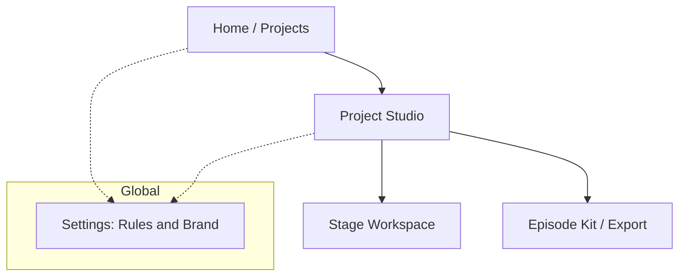
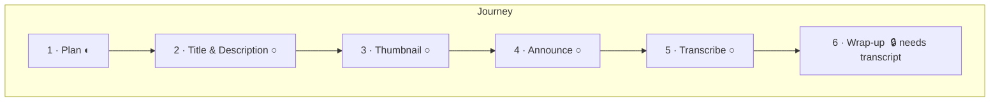
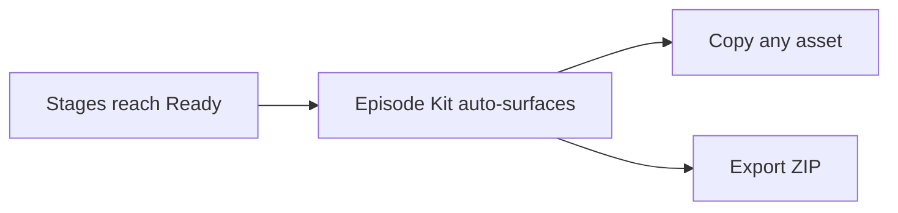

# Stream Helper — UX/UI Redesign Proposal

Status: proposal for review (no code changes yet)
Goal: make the whole workflow a joy to use, with an always-clear answer to
"where am I, what can I do, and what should I do next?"

---

## 1. Why the current UI feels strange

Concrete friction points in today's build:

1. **No sense of progress.** Six equal tabs (Pre-stream, Description, Thumbnail,
   Social, Transcription, Post-stream) with no indication of order, completion,
   or what depends on what. Everything looks equally "unstarted."
2. **Hidden core controls.** Working drafts, project notes, and "LLM definitions"
   live in side drawers behind toggles. The things you use most are hidden; the
   things you rarely need are always visible.
3. **Jargon leaks.** "LLM definitions", "effective prompt", "variant", "strategy",
   "Copy JSON", "Raw response JSON", "LLM context debug" — internal vocabulary is
   shown to the creator.
4. **Invisible dependencies.** Chapters/Summary silently require a transcript.
   Thumbnail/Description quietly reuse earlier outputs. The user only finds out by
   getting an error or by guessing.
5. **Flat result presentation.** Every generation dumps variant cards + a raw JSON
   `<details>`. There's no "here is the winner, here's how to use it" moment.
6. **No finish line.** "Mark final" and "Export ZIP" exist but nothing guides the
   user toward a satisfying "your episode kit is ready" completion.

The redesign keeps 100% of existing capability (same endpoints, same artifacts,
same storage) but reframes it as a **guided, progress-driven journey**.

---

## 2. Design principles

1. **One clear next step, always.** The UI always highlights the single most useful
   action, while keeping everything else reachable.
2. **Progressive disclosure.** Show the creator-facing essentials; tuck technical
   detail (raw JSON, composed prompt) behind a calm "Advanced" affordance.
3. **Speak the creator's language.** Replace engine jargon with plain words:
   _Options_ not _variants_, _Rules_ not _LLM definitions_, _Best pick_ not
   _recommended_.
4. **Make dependencies visible and friendly.** If a step needs a transcript, say so
   up front with a shortcut, not an error after the click.
5. **Celebrate momentum.** Completion states, checkmarks, and a final "episode kit"
   give the workflow a beginning, middle, and satisfying end.
6. **Calm, focused visuals.** Keep the existing modern aesthetic but reduce visual
   noise, increase whitespace, and use color intentionally (status, not decoration).

---

## 3. Information architecture

Three levels, each with a clear job:



- **Home (Projects):** pick or create a project. Each project card shows real
  progress ("4 of 6 stages have a final pick").
- **Project Studio:** the cockpit. A left **journey rail** (the 6 stages as a
  vertical stepper with status), a central **workspace**, and a right **context
  panel** (notes + the finished picks feeding this step).
- **Stage Workspace:** one focused task at a time with guidance, action(s),
  result, and history.
- **Episode Kit:** a summary of every "final pick" with copy/download, and the
  Export ZIP as the finish line.

---

## 4. The core idea: a guided journey rail

Replace the flat tab strip with a **vertical stepper** that doubles as navigation
and progress. Each stage shows a status chip:

- ○ **Not started** — no drafts, no outputs
- ◐ **In progress** — has drafts or generated options but no final pick
- ● **Ready** — a final pick is selected
- 🔒 **Needs a prerequisite** — e.g. Chapters/Summary before a transcript exists



The rail always has one stage marked **"Next up"** based on completion, so the
user never wonders where to go. Prerequisite locks are soft: clicking a locked
stage explains why and offers a one-click jump to the step that unlocks it
("Transcribe first →").

Stage renames (plain language):

| Current tab            | New name                | One-line intent                         |
|------------------------|-------------------------|-----------------------------------------|
| Pre-stream planning    | **1 · Plan**            | Decide the topic and guest              |
| Description            | **2 · Title & Description** | Write the YouTube title, description, tags |
| Thumbnail              | **3 · Thumbnail**       | Design the thumbnail                    |
| Social Media           | **4 · Announce**        | Create LinkedIn, X posts, hashtags      |
| Transcription          | **5 · Transcribe**      | Turn the recording into text            |
| Post-stream wrap-up    | **6 · Wrap-up**         | Generate chapters and a summary         |

---

## 5. Anatomy of a stage workspace

Every stage uses the same predictable 3-zone layout, so once you learn one, you
know them all.

```
┌─────────────────────────────────────────────────────────────┐
│  Stage title + status         [ Next up: Thumbnail → ]       │
├───────────────────────────┬─────────────────────────────────┤
│  WORKSPACE (center)        │  CONTEXT (right)                │
│                            │                                 │
│  ▸ What this step does     │  Uses these finished picks:     │
│  ▸ Your brief (autosaves)  │   • Topic: "…"        ●         │
│  ▸ [Primary action]        │   • Title: "…"        ●         │
│    [secondary] [secondary] │                                 │
│                            │  Project notes (peek)           │
│  ── Result ──────────────  │   …                             │
│  ★ Best pick  [Use] [Final]│                                 │
│  Other options (collapsed) │                                 │
│                            │                                 │
│  ⌄ History for this step   │                                 │
└───────────────────────────┴─────────────────────────────────┘
```

Key behaviors:

- **"What this step does"** — a single friendly sentence + the visible list of
  what it will reuse (pulled from the same context the composer already uses).
- **One primary button** per stage (e.g. _Generate description_), secondary
  actions de-emphasized (e.g. _Titles_, _Tags_). No wall of equal buttons.
- **Best pick first.** The recommended option is shown large with two obvious
  actions: **Copy** and **Set as final**. Other options collapse under
  "Show N more options."
- **Inline validation as helpful hints,** not raw codes: "Tags are 512/500 chars —
  trimmed to fit" instead of `YT_TAGS_TOO_LONG`.
- **Refine as a chat bubble** under each option ("Make it punchier"), unchanged in
  behavior but framed conversationally.
- **Advanced (collapsed):** raw JSON and the composed prompt move here, labeled
  "See exactly what the AI received." Nothing is removed — just demoted.

---

## 6. Stage-by-stage guidance

Each stage gets a **checklist of the possibilities** so the user always knows what
they *can* do and what to do next.

**1 · Plan**
- Do: write a brief → generate topic ideas → generate guest ideas → set a final topic.
- Next-step nudge: "Pick a final topic to unlock a stronger Title & Description."

**2 · Title & Description**
- Do: generate 15 titles → pick one; generate description; generate tags.
- Reuses: final topic/guest. Shows them in the context panel.

**3 · Thumbnail**
- Do: generate 10 ideas → turn the best into prompts → create external prompt
  package **or** built-in image.
- Guardrail: built-in image only appears when the provider supports it (OpenAI),
  otherwise shows "Switch to OpenAI mode to generate images here" instead of a
  dead button.

**4 · Announce**
- Do: LinkedIn post, X posts (280-safe), hashtags. Each with best pick + copy.

**5 · Transcribe**
- Do: set host/guest names → upload file **or** paste YouTube URL → watch progress.
- This stage is framed as the **gateway** to Wrap-up, with a clear "Unlocks
  chapters & summary" note and a live progress bar.

**6 · Wrap-up**
- Locked until a transcript exists; lock explains and links to step 5.
- Do: generate chapters (00:00-anchored, ascending) → generate summary → finalize.

---

## 7. The finish line: Episode Kit

A new **Episode Kit** view (reachable from the rail footer and auto-surfaced when
all stages are Ready) collects every final pick in one place:

- Title · Description · Tags · Thumbnail · LinkedIn · X posts · Hashtags · Chapters · Summary
- Each with a one-click **Copy**, thumbnails shown as images.
- A single **Export ZIP** button as the celebratory end state ("Your episode kit is
  ready — 9/9 picks finalized").

This gives the workflow a real destination and makes "am I done?" obvious.



---

## 8. Settings: Rules & Brand (was "LLM definitions")

Move the three instruction scopes + brand profile into a single **Settings**
surface with plain framing:

- **Global rules** — "Apply to every project" (e.g. _Never use dashes_).
- **Project rules** — "Apply to this project only."
- **Stage rules** — "Apply to one step" (inline, contextual, edited from the stage
  itself via a small "Rules for this step" link — no separate mental model).
- **Brand** — real form fields for preferred colors, required/banned words,
  thumbnail max words (today these exist in the model but have no UI).

Precedence is shown as a friendly line: **Stage rules win over Project, Project wins
over Global.**

---

## 9. Visual language

Keep the modern feel, dial down the noise.

- **Layout:** 3-column at desktop (rail / workspace / context); collapses to a top
  stepper + stacked panels on narrow screens.
- **Color = meaning:** neutral surfaces by default; a single accent for the primary
  action; status colors only for stage state (grey/amber/green) and validation.
- **Typography:** larger stage titles, clear section labels, generous line-height.
- **Motion:** subtle — a check animation when a stage turns Ready, a gentle slide
  for the "Next up" handoff. Remove the click-ripple-everywhere effect in favor of
  intentional feedback.
- **Empty states:** every panel gets a friendly first-run message with the exact
  next action, instead of "0 entries".
- **Density:** collapse "other options", history, and Advanced by default so the
  first screen is calm.

---

## 10. What stays exactly the same (low risk)

- All REST endpoints and payloads.
- Artifact model, versioning, finalize, refine, edit behavior.
- Storage layout, export/manifest, transcription pipeline and progress polling.
- Instruction composition and validation logic.

This is a **frontend + template** redesign (`project.html`, `projects.html`,
`project.js`, `projects.js`, `styles.css`) plus small, optional read-only helpers
(e.g. a "project progress" summary derived from existing `final.txt` markers). No
breaking backend changes required for v1 of the redesign.

---

## 11. Proposed implementation phases

1. **Foundations:** new layout shell (rail / workspace / context), design tokens,
   plain-language copy pass. No behavior change.
2. **Guided journey:** stage status derivation (from artifacts + drafts), "Next up"
   logic, soft prerequisite locks.
3. **Stage workspace polish:** best-pick-first results, collapsed options/history,
   Advanced drawer for JSON/prompt, friendly validation.
4. **Episode Kit + Export finish line.**
5. **Settings (Rules & Brand) with real brand fields.**
6. **Responsive + motion + empty states pass.**

Each phase is shippable on its own and keeps the app fully working.

---

## 12. Open questions for you

1. **Visual direction:** keep the current dark/mesh aesthetic (refined), or move to
   a lighter, calmer studio look?
2. **Scope for v1 of the redesign:** all six phases, or start with 1–3 (the biggest
   usability wins) and iterate?
3. **Episode Kit:** worth building now, or is Export ZIP enough for you today?
4. **Brand fields UI:** do you actually use preferred colors / required-banned words
   enough to warrant a dedicated editor, or keep it minimal?

---

# Part B — Workflow area redesign (the stage workspace)

Status: design only. Implementation will be done separately by a cheaper model.
This section is written to be executed without further clarification.

Phase 1 (journey rail + lighter theme) is already shipped. This part redesigns the
**inside of each stage** — the `.workflow-grid` (left `.workflow-main` with brief +
button row + inline result, right `.history-panel` with stacked "Stage history").

## B1. What's wrong today

1. **The brief is a blank gate.** Each stage opens with a large empty "Working brief"
   textarea and *then* a row of buttons. There's no default text, no examples, and no
   hint about what to write or which button needs what. The user must invent input
   before anything happens.
2. **Buttons lack context.** Several buttons (e.g. "Generate topic ideas", "Find guest
   ideas") all read from the *same* brief. It's unclear whether they need different
   input, and they sit visually detached below the textarea.
3. **History is a stacking wall.** The right column lists every category, and inside
   each, every version as a big collapsible card. After a few generations + inline
   edits (`-edited`) + refinements (`-refined`) + normalizations (`-normalized`), it
   becomes a tall pile of near-identical entries with no notion of "which one is
   current." Finding anything means scrolling and expanding.
4. **Duplication.** The newest result renders twice — once as variant cards in the
   left inline panel, and again inside the right history. Two places, overlapping info.
5. **Frequent vs rare are inverted.** Raw JSON and the "Latest stage result / Copy
   JSON" controls are always visible, while the thing you do constantly (see the
   current pick, tweak it, regenerate) has no privileged position.

## B2. The core reframe: a stage is a stack of **asset blocks**

Drop the left/main + right/history split. Model each stage as a single vertical
column of **asset blocks**, one per generation category the stage owns:

| Stage | Asset blocks (categories) |
|-------|---------------------------|
| 1 · Plan | Topic ideas, Guest ideas |
| 2 · Title & description | Titles (picker), Description, Tags |
| 3 · Thumbnail | Ideas → Prompts → Image (pipeline) |
| 4 · Announce | LinkedIn post, Social posts, Hashtags |
| 5 · Transcribe | Transcript (task card, special) |
| 6 · Wrap-up | Chapters, Summary |

An **asset block** is the unit the user actually thinks in ("I want a title", "I want
tags"). Each block owns its own generate button, its own optional guidance, its own
current pick, and its own compact history. This kills the shared-brief confusion and
the monolithic history wall in one move.

```
Stage header:  "2 · Title & description"   [status: In progress]
One-liner:     "Create the YouTube title, description, and tags."
────────────────────────────────────────────────────────────────
�¦ Titles                                        [● Final chosen]
  ┌ current pick ───────────────────────────────────────────────┐
  │  Building a Modern Spring App With AI Pair Programmers        │
  └──────────────────────────────────────────────────────────────┘
  [Copy]  [Regenerate]  [Refine ▾]         ⌄ 14 more options
  ＋ Add guidance                            ⌄ Versions (3)
────────────────────────────────────────────────────────────────
▩ Description                                   [empty]
  Writes the full YouTube description.   [ Generate description ]
  ＋ Add guidance
────────────────────────────────────────────────────────────────
▩ Tags                                          [empty]
  Produces SEO tags (≤500 chars).        [ Generate tags ]
  ＋ Add guidance
```

## B3. Asset block — the three states

Every block is one of three states, and it should visually collapse when it has less
to show, so a fresh stage is calm and short.

**1. Empty (compact, one line tall).**
- A small icon + asset name + a one-sentence "what this produces."
- A single **primary Generate button** — works with *no* input, using project
  context, notes, and prior finals. This is the #1 fix: generation is one click.
- A quiet `＋ Add guidance` link (see B4). No textarea shown until asked for.

**2. Has a current pick (the default working state).**
- Shows the **current pick** front and center. "Current pick" = the final version if
  one exists, else the recommended version, else the latest. Editable inline for
  editable categories (reuse existing `setupArtifactEditor`, autosave → `-edited`).
- A tight action row of the **frequent** actions, in priority order:
  `Copy` · `Regenerate` · `Refine ▾` · `Set as final` (hidden once already final).
- Right-aligned quiet disclosures: `⌄ Versions (N)` and, for multi-option categories,
  `⌄ N more options`.
- `＋ Add guidance` remains available to steer the next Regenerate.

**3. History / versions (collapsed by default, opened per block).**
- Opening `Versions (N)` reveals a **compact timeline**, not big cards:
  each row = a small version chip (`v3 · edited · 2m ago`), a single-line preview, and
  row actions `Make current` · `Copy` · `Duplicate to edit`.
- Rows are dense (≈2 lines each) and scroll inside a capped-height area so the block
  never dominates the page.
- See B5 for how derived versions are grouped.

## B4. Guidance: optional, contextual, one-tap

Replace the mandatory blank brief with **optional per-asset guidance**:

- Hidden behind `＋ Add guidance` on each block. Collapsed by default.
- When expanded: a small textarea with a **useful placeholder that shows a concrete
  example** for that asset (e.g. Titles → "e.g. lean more technical, include the word
  'Spring Boot', avoid clickbait").
- Above the textarea, a row of **one-tap suggestion chips** that prefill/append
  guidance, tuned per category. Examples:
  - Titles: `More technical` · `Punchier` · `Include keyword…` · `Shorter`
  - Description: `Add timestamps note` · `More SEO` · `Friendlier tone`
  - Hashtags: `Fewer, broader` · `Niche/technical`
  - Thumbnail ideas: `High contrast` · `Show a face` · `Big bold text`
- Guidance is remembered per asset in `projectConfig.workspaceDrafts` using
  **per-category keys** (e.g. `guidance:YOUTUBE_TITLES`) instead of one shared stage
  draft, so title guidance and tag guidance don't collide. Autosave path unchanged.
- Generate/Regenerate POST to the **same existing endpoints** with `{brief: guidance}`
  (empty string allowed). No backend change.

Result: the common path is a single click; the guided path is easy but never blocks.

## B5. History redesign — make versions legible

The stacking problem is solved by four rules:

1. **One current pick is always surfaced; the rest are "versions" behind a toggle.**
2. **Thread grouping.** Group a refine/edit chain under its origin using the existing
   `threadId` / `parentArtifactId`. A refined lineage reads as an indented mini-thread
   (`v1 → v2 refined → v3 edited`), not three unrelated top-level entries. The existing
   `buildRefinementTurnsByThread` logic is the seed for this.
3. **De-emphasize machine versions.** `-normalized` (e.g. social 280-char trim, tag
   ≤500 trim) should not appear as its own headline row; fold it into its parent with a
   small note ("auto-trimmed to fit"). Reuse the current normalization metadata.
4. **Compact, capped, filterable.** Timeline rows are one preview line; the list is
   height-capped with internal scroll; when a stage/block has multiple categories the
   block already scopes them, so no cross-category noise. A tiny segmented control
   `Current · All versions` toggles depth.

Deleting/pruning old versions is a **rare** action → hide it in a per-row overflow
`⋯` menu, not a primary button. (If no delete endpoint exists, omit; do not invent
backend.)

## B6. Frequency-based prominence (explicit ranking)

- **Tier 1 — always visible, biggest targets:** Generate / Regenerate, see current
  pick, Copy current, inline Edit current.
- **Tier 2 — one quiet click:** Refine, Set as final, open Versions, pick among "more
  options", Add guidance.
- **Tier 3 — tucked away (disclosure or `⋯`):** Raw response JSON, LLM context/effective
  prompt debug, per-version delete, "Copy JSON". The global `LLM context debug` card
  stays collapsed at the very bottom (as today). Remove the always-on "Copy JSON" /
  "Copy recommended" header buttons from each stage — copy lives on the current pick and
  per version instead.

## B7. Special-case blocks

- **Titles (options picker).** The one AI call returns 15 parsed options with exactly
  one recommended. Present the recommended as the current pick; put the other 14 under
  `⌄ 14 more options`, each a one-line row with a `Use this` button (→ finalize that
  option). This is a frequent, high-value interaction and deserves first-class UI.
- **Thumbnail (pipeline).** Ideas → Prompts → Image is sequential. Render the three
  blocks as a light numbered pipeline so the order is obvious. The built-in image
  button must only appear when the provider supports images (OpenAI); otherwise show a
  short inline note ("Image generation needs OpenAI mode") instead of a dead button.
  Keep the existing ordering guarantee (ideas action appears before prompts action) so
  `thumbnailStagePlacesIdeaGenerationBeforePromptGeneration` still holds.
- **Transcribe (task card).** Not a "generate" block. Keep the upload / YouTube-URL
  forms, host/guest names, and the progress bar, but reflow into one focused card:
  inputs first, live progress, then the resulting transcript shown as a single current
  asset with `⌄ Versions (N)` collapsed. Emphasize the "unlocks chapters & summary"
  relationship. Progress polling code stays as-is.

## B8. Layout & class notes for the implementer

- Replace `.workflow-grid` (two columns) with `.stage-flow` (single column, `gap`).
  Delete the separate `.history-panel` aside; history now lives inside each block.
- New building blocks (suggested class names):
  `.asset-block`, `.asset-block[data-state="empty|active"]`,
  `.asset-block-head` (icon + name + status chip),
  `.asset-current` (current pick + inline editor),
  `.asset-actions` (Tier-1/2 buttons),
  `.asset-guidance` (collapsed textarea + `.guidance-chips`),
  `.asset-options` (the "N more options" list),
  `.asset-versions` (`<details>` wrapping `.version-timeline` of `.version-row`).
- Keep using existing helpers: `renderInlineResult` becomes `renderAssetBlock`,
  `renderAreaHistory` becomes the per-block `renderVersions`, `setupArtifactEditor`,
  `finalizeArtifact`, `bindRefinementControls`, `reloadAreaHistory` all stay but are
  re-targeted to per-block containers. The `areaCompletionState` / journey-rail logic
  from Phase 1 keeps working unchanged (still keyed by area, driven by
  `hasArtifacts` / `hasFinal`).
- Preserve the calm light theme tokens from Phase 1. Status chips reuse the
  `Not started / In progress / Ready` colors.

## B9. Endpoints — all unchanged

Generate/Regenerate → existing `topic-ideas`, `guest-ideas`, `youtube-titles`,
`youtube-description`, `youtube-tags`, `linkedin-post`, `social-posts`, `hashtags`,
`chapters`, `summary`, `thumbnail-ideas`, `thumbnail-prompts`, `thumbnails/create`.
Edit → `PUT …/artifacts/{cat}/{id}`. Refine → `POST …/artifacts/{cat}/{id}/refine`.
Set as final / Use this / Make current → `POST …/artifacts/{cat}/{id}/finalize`.
Versions list → `GET …/artifacts/{cat}`. No new backend work required for this part.

## B10. Test impact (must be updated alongside implementation)

`PageControllerIntegrationTest` asserts markup/JS strings that this redesign changes.
The implementer must update these to match new markup, keeping intent:
- `inline-result-{area}` ids → will become per-block ids; update the "contains inline
  result section for every stage" test to the new per-stage container ids.
- Strings `Latest stage result`, `Copy JSON`, `Copy recommended`, `Stage history`,
  `Suggest title` → will change; update assertions to the new labels
  (e.g. `Generate titles`, `Current pick`, `Versions`).
- Keep satisfying: `Refinement chat` + `/refine` still present; `Export ZIP`;
  `data-tab="…"` values; `data-tab-panel="pre-stream"` not `hidden`; the thumbnail
  ideas-before-prompts ordering; the module-level JS function assertions
  (`startTranscriptionProgressMonitor`, `resolveRefinementTurnsForArtifact`,
  `initializeTranscriptionProgress`, `stopTranscriptionProgressPolling`,
  `createTimestampFormatter`) — keep those functions at module scope.
- `.result-raw[open] > summary::before` selector must remain in `styles.css` (the raw
  JSON disclosure survives inside the Tier-3 area).

## B11. Suggested build order (small, shippable steps)

1. **Block scaffold:** convert one stage (Plan) from grid → `.stage-flow` with two
   `.asset-block`s in empty/active states. Prove the pattern, update tests.
2. **Current pick + Tier-1 actions:** current-pick rendering, inline edit, Copy,
   Regenerate wired to existing endpoints.
3. **Optional guidance + chips:** per-asset guidance keys, suggestion chips.
4. **Versions timeline:** collapsed `Versions (N)`, thread grouping, machine-version
   folding, `Make current`.
5. **Refine popover + Set as final** on the current pick.
6. **Roll the pattern to Description (+ titles picker), Announce, Wrap-up.**
7. **Thumbnail pipeline** presentation + provider-aware image button.
8. **Transcribe task card** reflow (keep progress logic).
9. Remove the old `.history-panel` / `.workflow-grid` CSS once every stage is migrated.

Each step keeps the app working and is independently committable.
